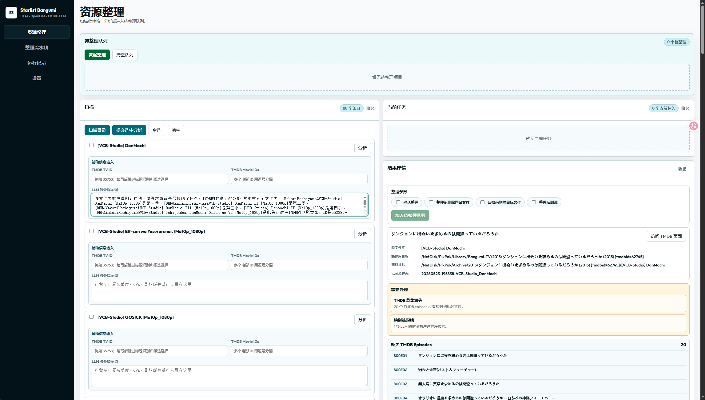
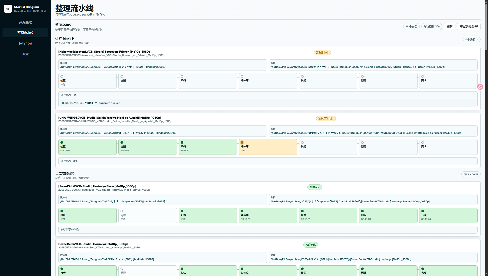

# Starlist Bangumi

Starlist Bangumi 是一个面向动画资源整理的本地工具。
基于 OpenList，扫描收件箱中的番剧文件夹，使用 TMDB 查询番剧信息，借助 LLM 辅助识别，最终交由用户确认执行。
个人主要使用 OpenList 挂载 Pikapk 网盘使用，因为离线下载番剧方便。

项目当前提供本地 Web UI 和 CLI 工具。Web UI 适合日常使用，CLI 适合调试、批处理和恢复任务。

## 功能简介

- OpenList 划分几个功能文件夹：
    - 收件箱文件夹，存放等待整理的番剧文件夹，一般用于离线下载。
    - 归档文件夹，整理前对源番剧的文件夹，按番剧信息进行拷贝备份。
    - 媒体文件夹，分为TV和Moview，用于存放整理后的资源。
- 扫描收件箱、分析选定番剧、生成整理报告、确认后发起整理任务。

## 运行环境

- Python 3.11 或更高版本，推荐 Python 3.13
- 可访问的 OpenList 服务
- TMDB API Key
- OpenAI 兼容格式的 LLM 接口

## 快速开始

创建虚拟环境并安装依赖：

```powershell
python -m venv .venv
.\.venv\Scripts\python.exe -m pip install --upgrade pip
.\.venv\Scripts\python.exe -m pip install -e ".[dev]"
```

复制配置模板：

```powershell
Copy-Item .\data\config.example.json .\data\config.json
```

编辑 `data/config.json`，填入 OpenList、LLM、TMDB 和媒体库路径配置。

启动 Web UI：

```powershell
.\start.ps1
```

默认会在浏览器中打开：

```text
http://127.0.0.1:8765
```

如果希望使用桌面 WebView 窗口：

```powershell
.\start.ps1 -Desktop
```

## 配置说明

配置文件位于：

```text
data/config.json
```

主要配置项：

- `openlist.base_url`：OpenList 地址，例如 `http://127.0.0.1:5244`
- `openlist.username` / `openlist.password`：OpenList 登录账号
- `llm.base_url`：OpenAI 兼容接口地址
- `llm.api_key`：LLM API Key
- `llm.model`：LLM 模型名
- `tmdb.api_key`：TMDB API Key
- `media_library.source_path`：OpenList 中的下载目录
- `media_library.tv_media_library_path`：番剧媒体库目录
- `media_library.movie_media_library_path`：电影媒体库目录
- `media_library.archive_path`：归档目录
- `scan.video_extensions`：视频后缀
- `scan.subtitle_extensions`：字幕后缀

## CLI 用法

分析指定文件夹：

```powershell
.\.venv\Scripts\python.exe tools\llm_debug_pipeline.py "[Folder Name]"
```

整理已生成的 run 记录：

```powershell
.\.venv\Scripts\python.exe tools\organize_run.py "data/runs/{run_id}"
```

中断后恢复整理：

```powershell
.\.venv\Scripts\python.exe tools\organize_run.py "data/runs/{run_id}" --resume-existing
```

手动指定 TMDB TV ID 重新映射：

```powershell
.\.venv\Scripts\python.exe tools\remap_run.py "data/runs/{old_run_id}" --tv-id 35753
```

列出运行记录：

```powershell
.\.venv\Scripts\python.exe tools\list_runs.py --latest-only
```

导出 Markdown 报告：

```powershell
.\.venv\Scripts\python.exe tools\export_report.py "data/runs/{run_id}"
```

预览清理旧记录：

```powershell
.\.venv\Scripts\python.exe tools\cleanup_runs.py --status failed
```

## Windows 构建

项目提供 Windows PyInstaller 打包脚本：

```powershell
powershell -ExecutionPolicy Bypass -File .\tools\build_windows.ps1 -Clean -Zip
```

构建产物：

```text
dist/windows/StarlistBangumi/
dist/windows/StarlistBangumi-0.1.0-win-x64.zip
```

## 截图





## License

本项目使用 MIT License。详见 [LICENSE](LICENSE)。
